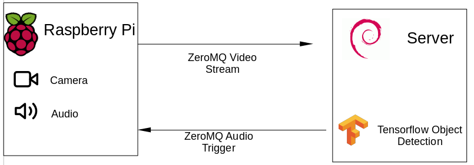
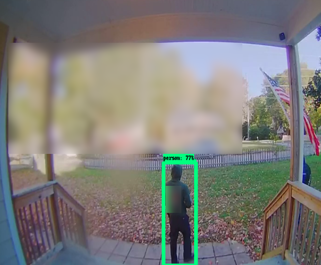

# Scarecrow-Cam
A `Raspberry Pi` powered edge-computing camera setups that runs a `Tensorflow` object detection model to determine whether a person is on the camera and plays loud audio to scare them off. 

Based on my [blog](https://chollinger.com/blog).





## Requirements
This project requires:
* A Raspberry Pi + the camera module v2 (the `client`) 
* Any Linux machine on the same network (the `server`)

## Install
This needs to be done on both the client (i.e., the raspbery) and the server.

### Raspberry specific
**Only** of you are on a `Raspberry Pi`, run:
```
sudo apt install python3-dev python3-pip python3-venv # Python 3
pip3 install --upgrade pip opencv-contrib-python==3.4.3.18
sudo apt install libjasper-dev  libilmbase-dev libopenexr-dev libgstreamer1.0-dev libhdf5-dev libhdf5-serial-dev libharfbuzz0b ffmpeg libqtgui4 libqt4-test libatlas-base-dev # for opencv-python
pip3 install --upgrade picamera
```

You will also need to edit `/etc/pip.conf` as follows (unless you are using a more modern raspbian distribution):
```
[global]
extra-index-url=https://www.piwheels.org/simple
```

See: [https://www.piwheels.org/](https://www.piwheels.org/)

Also see [./sbin/install_raspi.sh] for an example on how to set up a new Raspbery.

### General Instructions

**Use a virtual environment**
```
python3 -m venv env
source env/bin/activate
```

Install Object Detection Models:
```
git clone https://github.com/tensorflow/models.git
cd models/research
python3 setup.py build 
python3 setup.py install 
```

The project supports multiple ways for playing audio. If you want to use `Gstreamer` and `playsound`:
```
sudo apt install libcairo2-dev libgirepository1.0-dev
pip3 install vext.gi
sudo apt install gstreamer1.0-tools gstreamer1.0-plugins-good # Raspbian only
```

For `pygame`:
```
sudo apt install libsdl1.2-dev libsdl-image1.2-dev libsdl-mixer1.2-dev libsdl-ttf2.0-dev
```

Install `ffmpeg`, if not installed already:
```
sudo add-apt-repository ppa:mc3man/trusty-media
sudo apt update
sudo apt install ffmpeg
```

Install dependencies:
```
pip3 install -r server/requirements.txt # server
# OR
pip3 install -r client/requirements.txt # client
```

Use the [VidGear](https://github.com/abhiTronix/vidgear.git) development branch:
```
cd ~/workspace
git clone https://github.com/abhiTronix/vidgear.git
cd vidgear
git checkout development
pip3 install .
```

## Configuration and data
Edit the `conf/config.ini` with the settings for your Raspberry and server.

For playing audio, please adjust

```
[Audio]
Path=../audio_files
```
For an appropriate path.


## Run

### On the raspberry
```
python3 $PROJECT_LOCATION/client/sender.py --input 0 # for picam
python3 $PROJECT_LOCATION/client/sender.py --input '/path/to/video' # for local video
```

### On the server
```
python3 $PROJECT_LOCATION/server/receiver.py
```

## License
This project is licensed under the GNU GPLv3 License - see the [LICENSE](LICENSE) file for details.